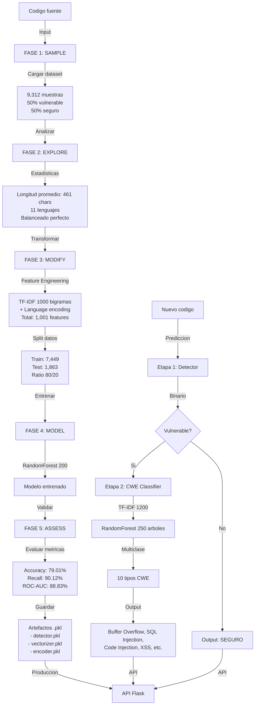

# Vulnerability Detection Pipeline

Sistema de deteccion de vulnerabilidades multilenguaje con arquitectura de dos etapas SEMMA.

## Caracteristicas

- **Deteccion binaria (Modelo 1)**: Vulnerable o seguro
- **Clasificacion multiclase (Modelo 2)**: 10 tipos de vulnerabilidad (CWE)
- **Multilenguaje**: Soporta 11 lenguajes de programacion
- **ML basado en TF-IDF**: Procesamiento eficiente de codigo
- **Arquitectura SEMMA**: Fases Sample, Explore, Modify, Model, Assess

## Lenguajes soportados

C++, Python, Java, JavaScript, C#, PHP, Ruby, Swift, Go, Kotlin, Fortran

## Estructura del proyecto

```
data/
  processed/
    cybernative_detector_training.csv (9,312 muestras binarias)
    securityeval_cwe_training.csv (4,656 muestras vulnerables)

models/
  vulnerability_detector.pkl
  vectorizer_detector.pkl
  language_encoder.pkl
  metrics_vulnerability_detector.txt
  cwe_classifier.pkl
  vectorizer_cwe_classifier.pkl
  cwe_encoder.pkl
  metrics_cwe_classifier.txt

modelo_1_detector/
  vulnerability_detector.py

modelo_2_clasificador/
  cwe_classifier.py
```

## Modelos

### Modelo 1: Vulnerability Detector

**Proposito**: Clasificacion binaria (vulnerable/seguro)

**Performance**:
- Accuracy (Test): 79.01%
- Precision: 73.73%
- Recall: 90.12% (minimiza falsos negativos - CRITICO)
- F1-Score: 81.10%
- ROC-AUC: 88.83%
- Overfitting: 6.80% (ACEPTABLE)

**Configuracion**:
- Algoritmo: RandomForest (200 arboles)
- Features: TF-IDF (1000, bigramas) + Language encoding (1 feature)
- Total features: 1,001
- Train/Test: 80/20 split (7,449 / 1,863)
- Datos: 9,312 muestras (50% vulnerable, 50% seguro)

**Confusion Matrix (Test)**:
- True Negatives: 633 (codigo seguro identificado correctamente)
- False Positives: 299 (codigo seguro marcado como vulnerable)
- False Negatives: 92 (error critico: vulnerabilidad NO detectada)
- True Positives: 839 (vulnerabilidad detectada correctamente)

### Modelo 2: CWE Classifier

**Proposito**: Clasificacion multiclase (tipo de vulnerabilidad)

**Performance**:
- Accuracy (Test): 86.94%
- Precision: 87.83%
- Recall: 86.94%
- F1-Score: 87.04%
- K-Fold CV (5-Fold): 87.62% ± 0.60%
- Overfitting: 5.82% (BAJO - EXCELENTE)

**Configuracion**:
- Algoritmo: RandomForest (250 arboles, max_depth=15, class_weight=balanced)
- Features: TF-IDF (1200, trigramas)
- Train/Test: 80/20 split estratificado (2,972 / 743)
- Datos: 3,715 muestras vulnerables (consolidadas de 4,656)
- Clases CWE: 10 categorias principales

**Distribucion de CWE (10 categorias)**:
1. Buffer Overflow: 1,350 muestras (36.4%)
2. SQL Injection: 634 muestras (17.1%)
3. Code Injection: 583 muestras (15.7%)
4. Null Pointer / Null Safety: 366 muestras (9.8%)
5. Insecure Deserialization: 184 muestras (4.9%)
6. Memory Management Issues: 163 muestras (4.4%)
7. Improper Input Validation: 148 muestras (4.0%)
8. Cross-Site Scripting (XSS): 219 muestras (5.9%)
9. Format String Attack: 32 muestras (0.9%)
10. Uninitialized Variables: 36 muestras (1.0%)

## Uso

### Opcion 1: API Flask (RECOMENDADO) ⭐

```bash
cd backend
pip install -r requirements.txt
python app.py
```

Luego accede a `http://localhost:5000/info`

**Endpoints disponibles**:
- `POST /analyze` - Análisis completo (detectar + clasificar)
- `POST /detect` - Solo detección binaria
- `POST /classify` - Solo clasificación CWE
- `GET /languages` - Lenguajes soportados
- `GET /cwe-types` - Tipos de vulnerabilidad
- `GET /health` - Verificar salud de la API

**Ejemplo con curl**:
```bash
curl -X POST http://localhost:5000/analyze \
  -H "Content-Type: application/json" \
  -d '{
    "codigo": "char buffer[10]; strcpy(buffer, user_input);",
    "lenguaje": "C++"
  }'
```

**Respuesta**:
```json
{
  "deteccion": {
    "vulnerable": 1,
    "confianza": 0.87,
    "probabilidades": {
      "seguro": 0.13,
      "vulnerable": 0.87
    }
  },
  "clasificacion": {
    "tipo_vulnerabilidad": "Buffer Overflow",
    "confianza": 0.92,
    "top_3_tipos": [
      ["Buffer Overflow", 0.92],
      ["SQL Injection", 0.03],
      ["Code Injection", 0.02]
    ]
  },
  "resumen": "⚠️ Código VULNERABLE detectado como 'Buffer Overflow' (87.0% confianza)"
}
```

**Cliente Python incluido**:
```bash
python backend/client.py
```

Ver más en: [backend/README.md](backend/README.md)

### Opcion 2: Ejecutar modelos directamente

```bash
cd modelo_1_detector
python vulnerability_detector.py

cd modelo_2_clasificador
python cwe_classifier.py
```

**Salida esperada**:
- 5 fases SEMMA con detalles de procesamiento
- Metricas de rendimiento en test set
- Artefactos guardados (.pkl) en models/

### Opcion 3: Usar modelos entrenados en Python

```python
import pickle

# Cargar Modelo 1 - Detector Binario
detector = pickle.load(open('models/vulnerability_detector.pkl', 'rb'))
vectorizer = pickle.load(open('models/vectorizer_detector.pkl', 'rb'))
lang_encoder = pickle.load(open('models/language_encoder.pkl', 'rb'))

# Codigo a analizar
codigo = "int x; x++;"
lenguaje = "C++"

# Transformar codigo
features = vectorizer.transform([codigo])

# Prediccion
is_vulnerable = detector.predict(features)[0]  # 0=Seguro, 1=Vulnerable
confidence = detector.predict_proba(features)[0]  # [Prob Seguro, Prob Vulnerable]

print(f"Vulnerable: {is_vulnerable}")
print(f"Confianza: {confidence}")

# Si es vulnerable, clasificar tipo CWE
if is_vulnerable:
    cwe_classifier = pickle.load(open('models/cwe_classifier.pkl', 'rb'))
    vectorizer_cwe = pickle.load(open('models/vectorizer_cwe_classifier.pkl', 'rb'))
    cwe_encoder = pickle.load(open('models/cwe_encoder.pkl', 'rb'))
    
    # Vectorizar para Modelo 2
    features_cwe = vectorizer_cwe.transform([codigo])
    
    # Predecir tipo CWE
    cwe_prediction = cwe_classifier.predict(features_cwe)[0]
    cwe_type = cwe_encoder.inverse_transform([cwe_prediction])[0]
    cwe_confidence = cwe_classifier.predict_proba(features_cwe)[0]
    
    print(f"Tipo CWE: {cwe_type}")
    print(f"Confianza CWE: {max(cwe_confidence):.2%}")
```

## Flujo de procesamiento



## Pipeline de dos etapas

**Etapa 1 - Deteccion binaria**:
```
Codigo texto
    ↓
TF-IDF (1000 bigramas)
    ↓
Language encoding (11 lenguajes)
    ↓
RandomForest Binario (200 arboles)
    ↓
Prediccion: Vulnerable (1) / Seguro (0)
```

**Etapa 2 - Clasificacion CWE** (solo si vulnerable):
```
Codigo texto
    ↓
TF-IDF (1200 trigramas)
    ↓
RandomForest Multiclase (250 arboles)
    ↓
Prediccion: 10 tipos CWE
    ↓
Output: Buffer Overflow, SQL Injection, Code Injection, ...
```

## Dataset

- **Modelo 1**: CyberNative DPO (Hugging Face)
  - 9,312 muestras totales
  - 4,656 vulnerable + 4,656 seguro
  - Perfectamente balanceado
  
- **Modelo 2**: SecurityEval dataset
  - 4,656 muestras vulnerables originales
  - 3,715 muestras procesadas (filtrando clases con <10 muestras)
  - 10 categorias CWE principales consolidadas

## Metodologia SEMMA

Ambos modelos siguen estrictamente la metodologia SEMMA dividida en 5 fases:

1. **SAMPLE**: Cargar, validar e inspeccionar datos
2. **EXPLORE**: Analisis estadistico y distribucion de clases
3. **MODIFY**: Feature engineering, normalizacion y preparacion
4. **MODEL**: Entrenamiento y ajuste de hiperparametros
5. **ASSESS**: Evaluacion, metricas y analisis de performance

## Archivos de salida

- `models/vulnerability_detector.pkl` - Modelo 1 serializado
- `models/vectorizer_detector.pkl` - Transformador TF-IDF Modelo 1
- `models/language_encoder.pkl` - Codificador de lenguajes
- `models/metrics_vulnerability_detector.txt` - Metricas detalladas Modelo 1
- `models/cwe_classifier.pkl` - Modelo 2 serializado
- `models/vectorizer_cwe_classifier.pkl` - Transformador TF-IDF Modelo 2
- `models/cwe_encoder.pkl` - Codificador de tipos CWE
- `models/metrics_cwe_classifier.txt` - Metricas detalladas Modelo 2

## Proximos pasos

1. ✅ **API Flask**: Endpoints `/detect`, `/classify`, `/analyze` implementados
2. **GitHub Actions**: Integrar con CI/CD para analizar PR automaticamente
3. **Dashboard**: Visualizar metricas y performance en tiempo real
4. **Optimizacion**: Experimentar con XGBoost, SVM, redes neuronales
5. **Tuning**: Grid Search para optimizar hiperparametros
6. **Versionado**: Guardar versiones de modelos para auditoria
7. **SHAP**: Explicabilidad de predicciones
